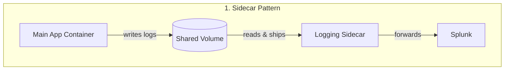
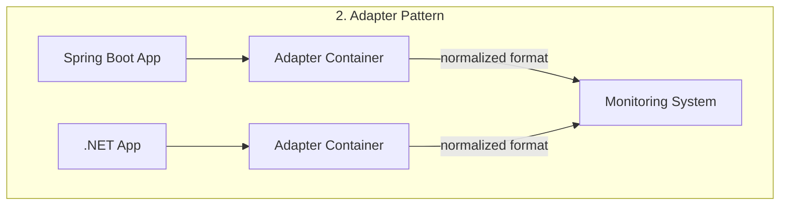
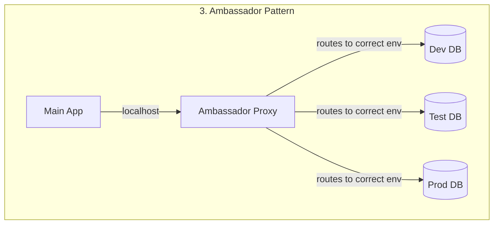

Features three patterns

### 1. side car
example is a logging agent, maybe like a splunk producer, so that they share the lifecycles storage and network space
The main app doesn't need to know about the sidecar's existence

#### 2. Adapter
if many different pods need the same kind of post processing for the traffic going out, we use the adapter pattern, used to maintain consistency across services
example :- monitoring data normalization, API response transformation.
why do we need it? imagine services written in different languages, spring boot and .net, they both have different format of responses, so an adapter can normalize it to a defined standard without having to make changes to the main applications, and maintaining the logic in both the places

#### 3. Ambassador
when our application communicates with different databases, dev, test and prod
we can achieve that with the Ambassador pattern where the second container is used to communicate with the appropriate database server, so that no matter the environment the core application can always communicate to the database via local host, and the ambassador relays that to the right server
The ambassador is the proxy between the main application and the external services
example :- load balancing across databases, service discovery





The manifest doesnt have any difference between the three, these are just high level patterns for microservices

```yaml
apiVersion: v1
kind: Pod
metadata:
  name: app
  namespace: elastic-stack
  labels:
    name: app
spec:
  containers:
  - name: app
    image: kodekloud/event-simulator
    volumeMounts:
    - mountPath: /log
      name: log-volume
  - name: sidecar
    image: kodekloud/filebeat-configured
    volumeMounts:
    - mountPath: /var/log/event-simulator/
      name: log-volume
  volumes:
  - name: log-volume
    hostPath:
      # directory location on host
      path: /var/log/webapp
      # this field is optional
      type: DirectoryOrCreate
```