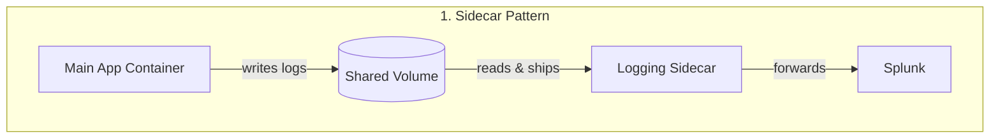
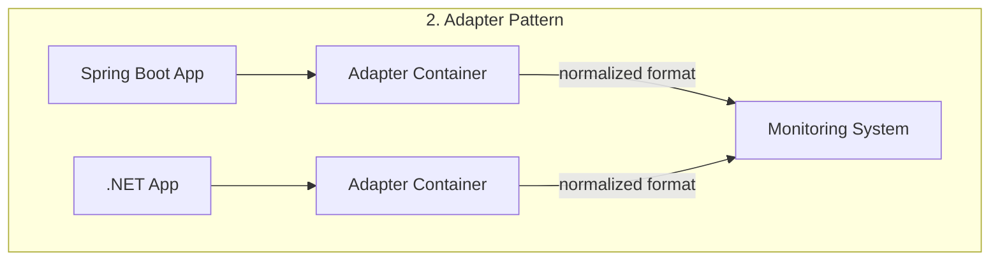
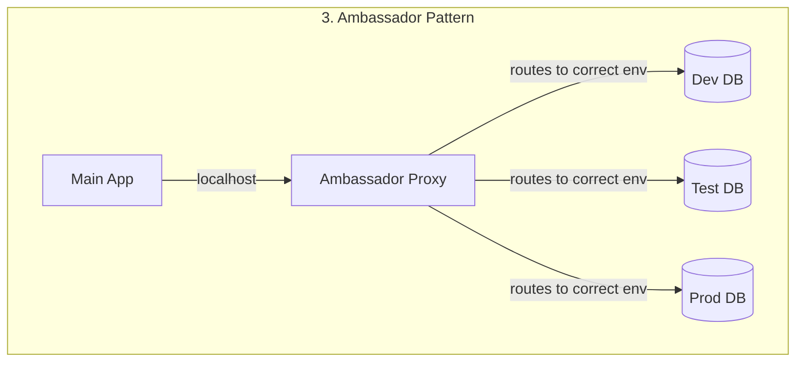

Features three patterns

### 1. side car
example is a logging agent, maybe like a splunk producer, so that they share the lifecycles storage and network space
The main app doesn't need to know about the sidecar's existence

#### 2. Adapter
if many different pods need the same kind of post processing for the traffic going out, we use the adapter pattern, used to maintain consistency across services
example :- monitoring data normalization, API response transformation.
why do we need it? imagine services written in different languages, spring boot and .net, they both have different format of responses, so an adapter can normalize it to a defined standard without having to make changes to the main applications, and maintaining the logic in both the places

#### 3. Ambassador
when our application communicates with different databases, dev, test and prod
we can achieve that with the Ambassador pattern where the second container is used to communicate with the appropriate database server, so that no matter the environment the core application can always communicate to the database via local host, and the ambassador relays that to the right server
The ambassador is the proxy between the main application and the external services
example :- load balancing across databases, service discovery





The manifest doesnt have any difference between the three, these are just high level patterns for microservices

```yaml
apiVersion: v1
kind: Pod
metadata:
  name: app
  namespace: elastic-stack
  labels:
    name: app
spec:
  containers:
  - name: app
    image: kodekloud/event-simulator
    volumeMounts:
    - mountPath: /log
      name: log-volume
  - name: sidecar
    image: kodekloud/filebeat-configured
    volumeMounts:
    - mountPath: /var/log/event-simulator/
      name: log-volume
  volumes:
  - name: log-volume
    hostPath:
      # directory location on host
      path: /var/log/webapp
      # this field is optional
      type: DirectoryOrCreate
```

### initContainers
In a multi container Pod one container atleast is expected to run as long as the PODs lifecycle
in case we want a container to run to completion before the actual process begins we can define it in **`initContainers`**
```yml
apiVersion: v1
kind: Pod
metadata:
name: myapp-pod
labels:
app: myapp
spec:
containers:
- name: myapp-container
  image: busybox:1.28
  command: ['sh', '-c', 'echo The app is running! && sleep 3600']
initContainers:
- name: init-myservice
  image: busybox
  command: ['sh', '-c', 'git clone <some-repository-that-will-be-used-by-application> ;']
```

When a POD is first created the initContainer is run, and the process in the initContainer must run to a completion before the real container hosting the application starts.

You can configure multiple such initContainers as well, like how we did for multi-pod containers. In that case each init container is run **one at a time in sequential order**.

If any of the initContainers fail to complete, Kubernetes restarts the Pod repeatedly until the Init Container succeeds.    

we can check the state of the init container in a pod with
> `kubectl get pod <pod-name> -o jsonpath='{.status.initContainerStatuses[*].state}{"\n"}'`

or we can find the same in kubectl describe 

https://claude.site/artifacts/bfea7d26-74b1-43e6-a327-2b7f9f0e04f2


```
draw this

graph TB
    subgraph "Kubernetes Cluster"
        subgraph "Node 1"
            logs1["/var/log/containers/**.log"]
            app1[App Pod]
            pt1[Promtail Pod]
            loki[Loki Pod]
            
            logs1 -->|reads| pt1
            pt1 -->|streams logs| loki
            app1 -->|writes| logs1
        end
        
        subgraph "Node 2"
            logs2["/var/log/containers/**.log"]
            app2[App Pod]
            pt2[Promtail Pod]
            
            logs2 -->|reads| pt2
            pt2 -->|streams logs| loki
            app2 -->|writes| logs2
        end
        
        subgraph "Node 3"
            logs3["/var/log/containers/**.log"]
            app3[App Pod]
            pt3[Promtail Pod]
            
            logs3 -->|reads| pt3
            pt3 -->|streams logs| loki
            app3 -->|writes| logs3
        end
    end
    
    grafana[Grafana Instance] -->|"http://loki:3100/metrics"| loki
    
    classDef pod fill:#326ce5,stroke:#fff,stroke-width:2px,color:#fff
    classDef storage fill:#ffa500,stroke:#fff,stroke-width:2px,color:#fff
    classDef external fill:#28a745,stroke:#fff,stroke-width:2px,color:#fff
    
    class app1,app2,app3,pt1,pt2,pt3,loki pod
    class logs1,logs2,logs3 storage
    class grafana external
```


```
// Diagram elements

Kubernetes Cluster [icon: k8s-cluster, color: white] {

  Node 1 [icon: k8s-node] {

    App Pod 1 [icon: k8s-pod, label: "App Pod"]

    Logs 1 [icon: file-text, label: "/var/log/containers/**.log"]

    Promtail Pod 1 [icon: k8s-pod, label: "Promtail Pod"]

  }

  

  Node 2 [icon: k8s-node] {

    App Pod 2 [icon: k8s-pod, label: "App Pod"]

    Logs 2 [icon: file-text, label: "/var/log/containers/**.log"]

    Promtail Pod 2 [icon: k8s-pod, label: "Promtail Pod"]

  }

  

  Node 3 [icon: k8s-node] {

    App Pod 3 [icon: k8s-pod, label: "App Pod"]

    Logs 3 [icon: file-text, label: "/var/log/containers/**.log"]

    Promtail Pod 3 [icon: k8s-pod, label: "Promtail Pod"]

  }

  

  Loki [icon: openai]

}

  

Grafana [icon: monitor]

  

// Connections

App Pod 1 > Logs 1: writes

Logs 1 > Promtail Pod 1: reads

Promtail Pod 1 > Loki: streams logs

  

App Pod 2 > Logs 2: writes

Logs 2 > Promtail Pod 2: reads

Promtail Pod 2 > Loki: streams logs

  

App Pod 3 > Logs 3: writes

Logs 3 > Promtail Pod 3: reads

Promtail Pod 3 > Loki: streams logs

  

Grafana > Loki: loki:3100/metrics
```